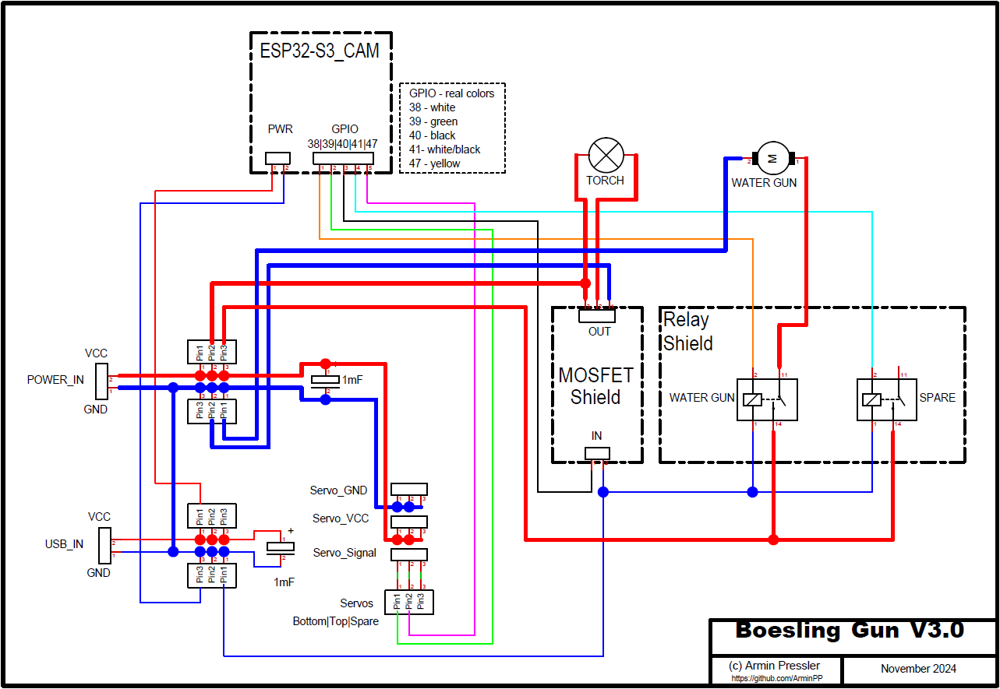

# **Boesling \*) Gun 3.0 - a cat protection system**
*) boesling means 'bad boy' in the Austrian dialect 
### First of all: I really like cats and pets.

**But most of all I love my cat :-)**

My cat, Fellina, is about 15 years old (around 80 years in human age) and suffers from atrosis.
We live in the country and there are lots of other cats nearby.
Every now and then a new young player appears and tries to bully Fellina.
She is a tiny cat weighing 3.5kg and sometimes finds it difficult to protect her territory.
I can watch it with some "CatCams" I've installed in the past, but I can't help her if a bully shows up.

So I decided to build a repellent that would **scare away other cats but not hurt** them.

After some internet research I came across 2 remarkable sites:

[https://randomnerdtutorials.com/esp32-cam-pan-and-tilt-2-axis/](https://randomnerdtutorials.com/esp32-cam-pan-and-tilt-2-axis/)

[https://github.com/jonathanrandall/esp32\_cam\_electric\_watergun/tree/main](https://github.com/jonathanrandall/esp32_cam_electric_watergun/tree/main)

I took both program ideas as a basis and built my own modifications around them.

The software wasn't so much the problem for me (due to the great preparatory work from above), but the hardware was very challenging.
 
### Software:
I use PlatformIO to write the code. 

As far as I know, the ESP32-S3 Cam is only supported by Arduino V3, which isn't officially supported by PlatformIO. 
So I used a workaround form Max Gerhard https://community.platformio.org/t/moving-from-arduino-ide-to-platformio-ide/42372/9. (Please see the platformio.ini file)

Alternatively, you can also use the Arduino IDE, it supports Arduino 3+ from the scratch.  

 
 
 
 

**I added some new features to the software:**
 
 

The servo positions of the bottom (horizontal) and top (vertical) servo are shown in the top line (simplifies the determination of predefined positions). 
The core temperature helps to avoid overheating during summer time. 
If something went wrong, but the ESP is still accessible via WiFi, it is possible to reboot the device. 
The heartbeat display (not in the screenshot) is used to check whether the website is still active. Sometimes the video stream disappears but the site is still active, you can't tell at first glance. This especially happens if I am connected via VPN...
 
The core temperature monitoring is important during summer time to prevent the ESP from overheating in the waterproov and sealed housing. 
The RSSI value is sometimes useful if the WiFi connection is bad.   
 

There are 4 predefined positions that are approached immediately.
The idea is that if I spot a Boesling on a CatCam, I first have to connect remotely, open the website and use the navigation keys to navigate to the destination. Then turn on the lamp and fire the gun.
At this point, every cat is out of the woods! The POS keys do all this for me, and I can at least catch the tip of a Boesling's tail ;-)
 
 

If the "Aim & Fire" option is checked, the flashlight and water gun will also be launched.
 
 

The navigation keys are self-explanatory, the movement of the servo drives per key press is 5° and for the quick keys "<< | >>" it is 15°.
 
 

If you like to navigate manually, you can separately turn on the light and fire the gun.
 
 

There is also a predefined home position where the gun is leveled so that it does not lose water in summer. When the gun is tilted down it tends to dribble water...

 
 

### Hardware:
 

 
Fellina doesn't care as long as there is enough food
 
 
BOM:

* <a href="https://www.amazon.de/dp/B0CYSM6V9C">ESP32-S3 Cam (or any ESP Cam) [Amazon.de link]</a>  
* <a href="https://www.amazon.de/gp/product/B0094AZU0M">top servo, waterproof (6 Kg 180°) [Amazon.de link]</a> 
* <a href="https://www.amazon.de/gp/product/B0DHNG5L66">bottom Servo, waterproof (bottom 12 Kg 270°) [Amazon.de link]</a> 
* <a href="https://www.amazon.de/gp/product/B081JMQKDM">Servo brackets, aluminium [Amazon.de link]</a> 
* <a href="https://www.amazon.de/dp/B005FEGYCO"> simple flashlight, battery driven [Amazon.de link]</a>  
* <a href="https://www.amazon.de/dp/B0CW35JD8R"> electric water gun [Amazon.de link]</a>   
* <a href="https://www.amazon.de/dp/B07HBQZ9BK"> MOS FET driver [Amazon.de link]</a>   
* <a href="https://www.amazon.de/gp/product/B09FRY9JK4"> relay shield [Amazon.de link]</a>  
* <a href="https://www.amazon.de/dp/B0895QP7VF"> action cam housing, waterproof [Amazon.de link]</a>  
* aluminium u-profile
* stable ground plate
* plastic or plexi glass cover, threaded rods
* <a href=" https://www.amazon.de/gp/product/B08R9WLLSZ">silicone insulated copper wires (because of the minus degrees outside) [Amazon.de link]</a> 
* <a href="https://www.amazon.de/dp/B00S9OTJYC"> strong power supply 5 VDC / 12 A [Amazon.de link]</a>   
* usb power supply ~500 mA - 1 A
* <a href="https://www.amazon.de/dp/B0C7QTH352"> a waterproof housing for the power supplies [Amazon.de link]</a> 
* some screws and electrical tools

#### Prototype
I would suggest making the device as high-quality as possible because it should work outside in the rain or even in winter when temperatures are below zero.

My first prototype was built with this cheap <a href="https://www.amazon.de/gp/product/B0DBYRP8ZB">plastic touretts [Amazon.de link]</a> available on the Internet. The whole thing was extremely wobbly and the small micro servos were too weak to hold the load.

#### Schematic

The circuit diagram is not too complex, I use two independent 5V power supplies to avoid any EMC interference. 
In the 3rd version of this project I use a 5V@12A (! there was no smaller one available ;-) power supply for LED strips. It is waterproof and strong enough to absorb the extreme voltage peaks of the water gun's simple pump motor. The original switched-mode power supply always switched off briefly due to the peaks, which is unfortunately not usable. 
Nevertheless, I use a buffer capacitor (1000µF) for both voltage sources. 
Both sources are independent, but the grounds are connected.
 
The relay shield also works with 3.3V from the ESP32, and it is possible to change the logic via jumpers. This is important because the ESP's GPIOs are 'high' during booting and the cannon might start firing...
 
For the LED flashlight I use a MOSFET (motor driver) to be able to switch it on and off every hundrets of milliseconds. 
I use a relay shield for the pump motor. I equipped the motor with a freewheeling diode and interference suppression capacitors.
(https://custom-build-robots.com/raspberry-pi-elektronik/raspberry-pi-roboter-elektrische-stoerungen-der-entstoerkondensator/7930)
 

#### Hardware assembly

Turret:
 

 
I shortened the upper arm to get better torque
 

 
Assembly of the top plate with 2 U-profiles for the flashlight and the water gun. In the middle is the mount for the GoPro housing
  
Dismantle the water gun and tuninig the motor: 

 
LED flashlight:
 

 
Instead of batteries (3x1.5V) I use an adjustable step-down converter. I had to learn it the hard way that with LED flashlights every 1/10 V counts. At the beginning I used 5V DC and after a few tries the LED lamps burned out :-(
 

 
Gluing the tiny antenna plug is recommended. I use the programming board as an additional option and soldered the wires there. This means the cam fits better in the housing. 

 
The cam only holds by being clamped with various foam rubber blocks.  
In addition, a small packet of silica gel is included to absorb the condensation.
 

 
From a messy prototype to a serious board ;-)
 

 
This is still the box with the power supplies from the first version, but the current version is basically the same... 
I use a 230 VAC cable to power both devices (yellow one from the left). The USB plug-in power supply is used to supply the ESP and the peripherals, the large power supply for the motors and pumps and the flashlight, see circuit diagram.
 

#### Final assembly
 

 
The flashlight and the watergun are attached to the U-profiles with a zip tie.  
In the back of the turret the electrical box is mounted.
 

 
Finally, the entire unit is mounted to the patio railing, with the new green waterproof box for the larger power supplies.
 